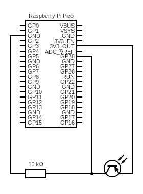

# Measurement Station
## Hardware
- Raspberry Pi Pico W
- 10kΩ resistor
- Photoresistor
- Breadboard

## Hardware Configuration
All the components were mounted on a breadboard according to the following schematic:

## Scripts
There a two micropython scripts:
1. `sensor_raw.py` and
2. `sensor_sequence.py`

The first script measures a single brightness value and transmits it to the hub. 
The second script takes multiple measurements and transmits their average to the hub.

The corresponding parameters may need to be adapted.

You also need to provide a `secrets.py` file with the fields `SSID` and `PWD` to be able to connect to the local wireless network.

### Measuring brightness
First, the Raspberry Pi Pico W needs to be flashed with the latest firmware and micropython version (which can be found [here](https://micropython.org/download/rp2-pico-w/)).

After successfully flashing the microcontroller, you can use a graphical user interface program like [Thonny](https://thonny.org/) or a commandline-based tool like [ampy](https://pypi.org/project/adafruit-ampy/) or [rshell](https://pypi.org/project/rshell/) to write the scripts onto the microcontroller.

Renaming the script `sensor_....py` to `main.py` ensures that the script is executed as soon as the microcontroller is powered on. Thus, no manual invoking of the script(s) is needed.